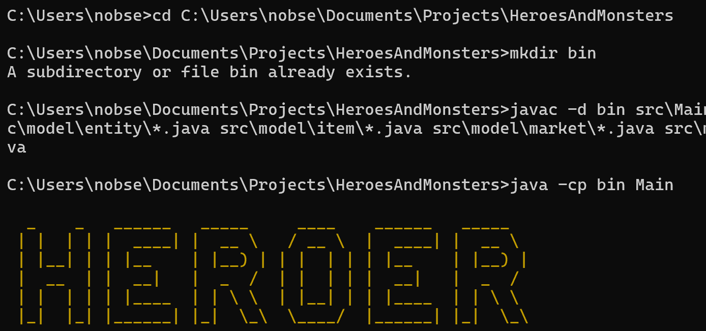
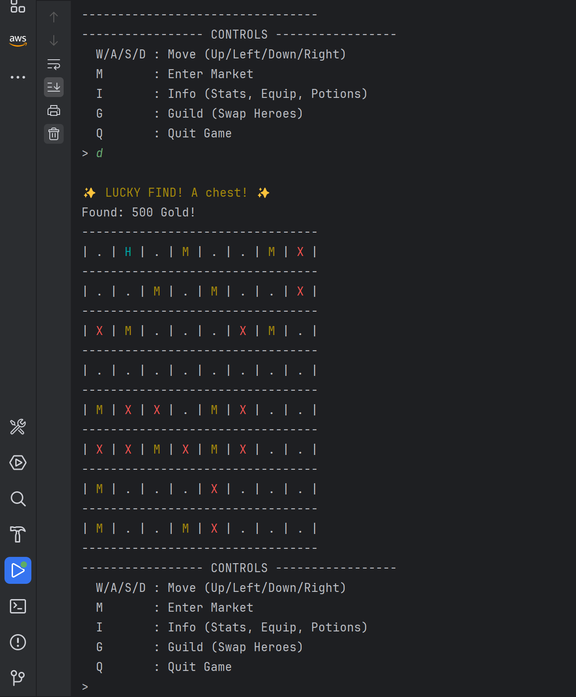
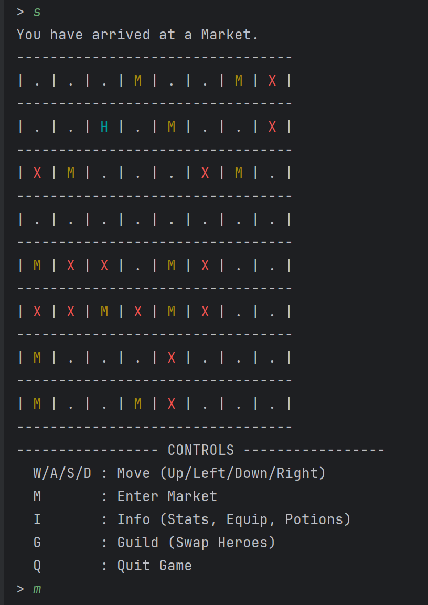
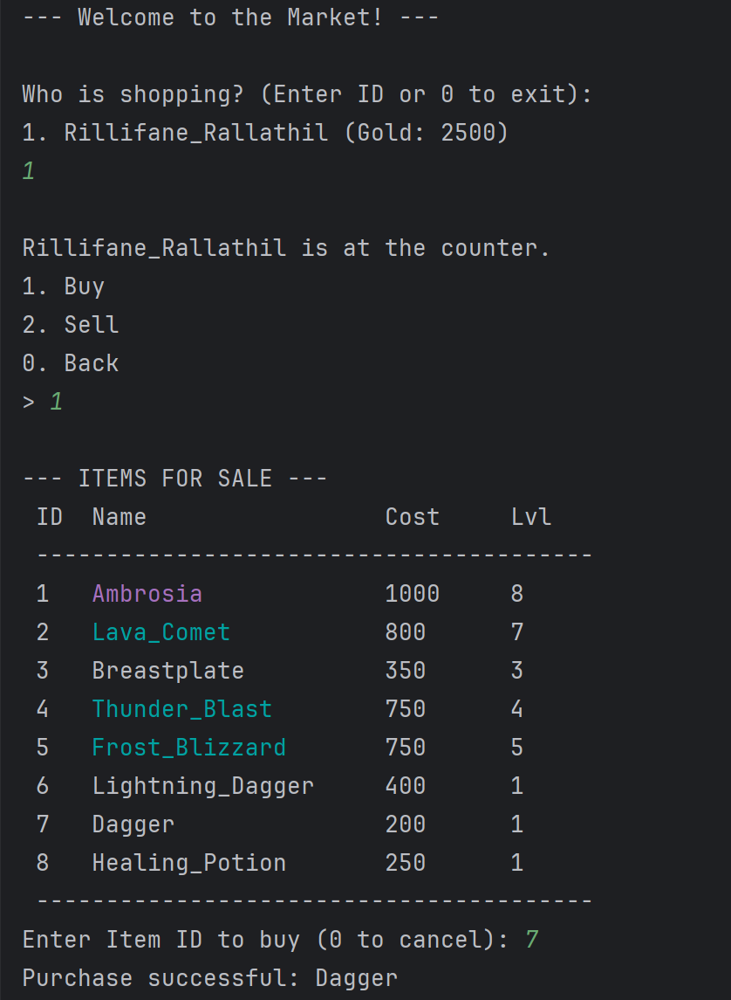
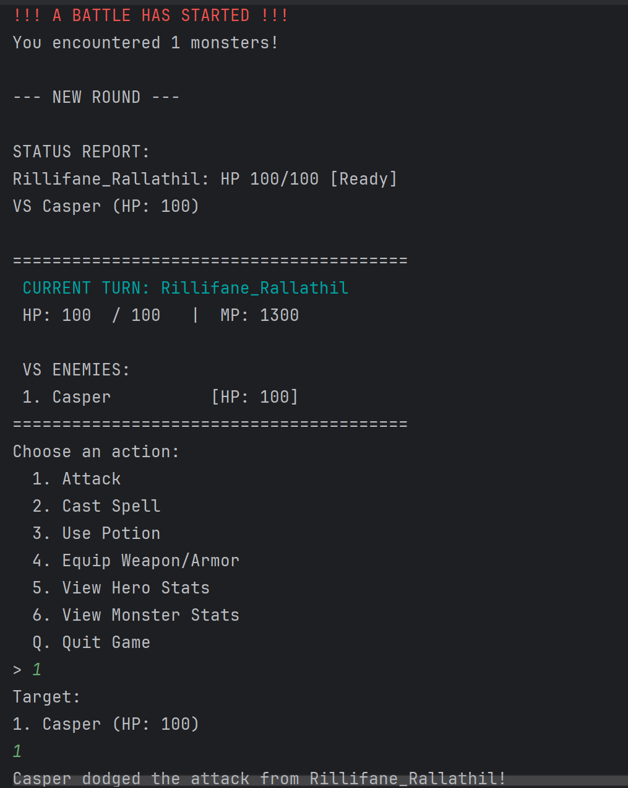
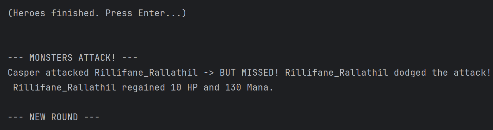
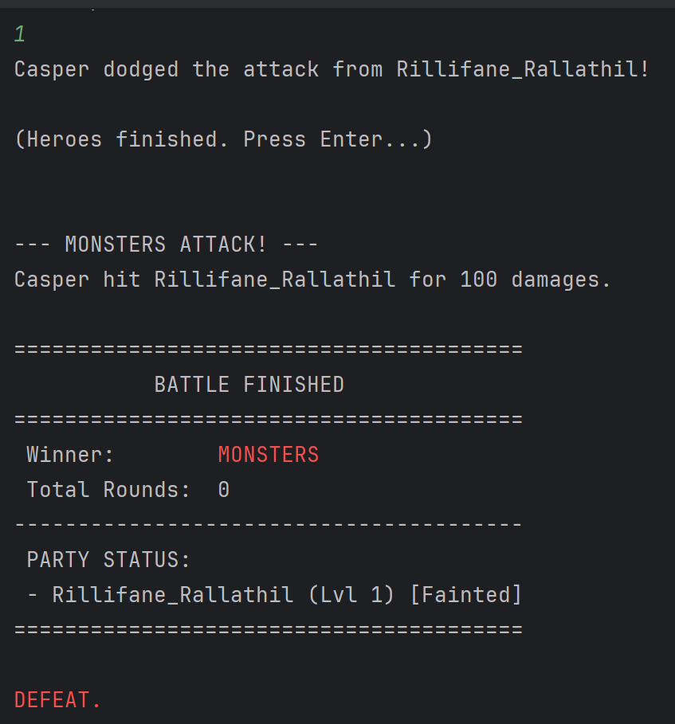
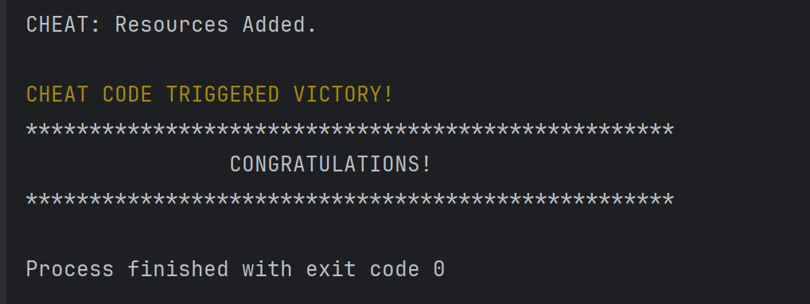
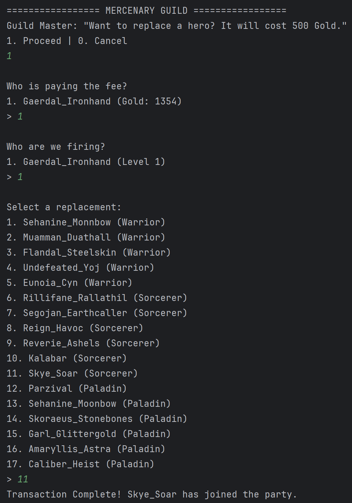

# Legends: Monsters and Heroes
CS 611 Assignment - RPG Game

HOW TO RUN
------------------------------------------------------
1. Download and unzip the file.
   You should have something like this:
   ```bash
   cd "<your directory>\HeroesAndMonsters"
   ```
2. Ensure all configuration files (.txt) are in the project root directory:
    - Warriors.txt, Sorcerers.txt, Paladins.txt
    - Dragons.txt, Exoskeletons.txt, Spirits.txt
    - Weaponry.txt, Armory.txt, Potions.txt
    - Spells files (Fire/Ice/Lightning)
    - (Optional) theme.wav for background music

3. Compile the Java files:

3.1. Create a `bin` directory for compiled classes:
   ```bash
   mkdir bin
   ```
3.2. Compile all Java files into the `bin` directory:
   ```bash
   javac -d bin src\Main.java src\controller\*.java src\model\*.java src\model\entity\*.java src\model\item\*.java src\model\market\*.java src\model\world\*.java src\util\*.java src\view\*.java
   ```
4. Run the application from the `bin` directory:
   ```bash
   java -cp bin Main
   ``` 
Run: 
NOTE:
ANSI colors are required for the board display. If you are on Windows, use PowerShell or Windows Terminal rather than the legacy CMD.
Use a monospaced console font (like Consolas or Courier New) for best grid alignment.
   
CONTROLS
------------------------------------------------------
- W/A/S/D : Move Party
- M       : Enter Market (Buy/Sell)
- I       : Info Menu (Equip Items, Use Potions, View Stats)
- G       : Mercenary Guild (Swap Heroes for Gold)
- Q       : Quit Game

DESIGN ANALYSIS: EXTENSIBILITY & SCALABILITY
------------------------------------------------------
The application was architected to prioritize Scalability and Extensibility through five key mechanisms:

1. DATA-DRIVEN DESIGN (Factory Pattern)
   The game content is decoupled from the source code. Heroes, Monsters, and Items are loaded via the `GameDataParser` factory.
   - Scalability: The game supports an infinite number of hero/monster types without performance degradation or code changes.
   - Extensibility: A new Hero type (e.g., "Necromancer") can be added simply by creating a text file and a subclass.

2. PROCEDURAL GENERATION (Algorithmic Scalability)
   The world generation logic (`Board.java`) utilizes relative percentages rather than hard-coded coordinates.
   - Scalability: The map size is defined by constants (`BOARD_WIDTH`, `BOARD_HEIGHT`) in `GameConfig`. The game can scale from an 8x8 grid to a 50x50 grid instantly by changing two integers, with walls and markets distributing automatically.
   - User Experience: The starting area is guaranteed to be free of walls, ensuring players can always move at the start.

3. MVC ARCHITECTURE (Separation of Concerns)
   The code strictly follows Model-View-Controller.
   - Model: Pure data objects (`Hero`, `Monster`).
   - View: Pure console output (`GameView`).
   - Controller: Pure business logic (`HeroController`, `BattleController`).
   - Extensibility: The UI can be swapped from Console to JavaFX/GUI simply by replacing the `GameView` class, as the Controllers contain no UI-specific logic.

4. CENTRALIZED CONFIGURATION (Logic Scalability)
   All game balance constants (Damage ratios, XP thresholds, Drop rates) are centralized in `GameConfig.java`.
   - Scalability: Game balance can be tuned globally (e.g., increasing difficulty for high-level play) by modifying a single file, adhering to the "Single Source of Truth" principle.

5. POLYMORPHISM & INTERFACES
   The system relies on contracts (`Item` interface, `LivingEntity` abstract class).
   - Extensibility: New items (e.g., a "Grenade") can be implemented by adhering to the `Item` interface. The `InventoryController` and `MarketController` will accept and process these new items immediately without modification.

ARCHITECTURE & DESIGN (MVC)
------------------------------------------------------
This project strictly follows the Model-View-Controller (MVC) pattern to ensure high cohesion and low coupling.

1. MODEL (The Data)
   - Entities (Hero, Monster) are pure data objects. They hold state (HP, Mana, Inventory) but do not contain business logic or UI code.
   - Polymorphism is used for Hero types (Warrior/Sorcerer/Paladin) to define unique stat growth rules.

2. VIEW (The Presentation)
   - GameView handles all console output. It renders the ASCII board, detailed stat sheets, and menus.
   - Colors class handles ANSI color codes for readability.

3. CONTROLLER (The Logic)
   - GameController: Acts as the central router for the application.
   - BattleController: Manages the turn-based combat loop and win/loss states.
   - HeroController: Handles business logic for progression (XP loops, Level Up calculations, Combat math).
   - InventoryController: Manages state changes for equipment and consumables.
   - MarketController: Handles the economy and transaction validation.
   - GuildController: Manages the "Mercenary Swap" feature logic.

CLASS DIAGRAM
------------------------------------------------------
Below is the architecture visualization. *(Note: This requires a Markdown viewer with Mermaid support, like IntelliJ or GitHub).*

```mermaid
classDiagram
    %% --- CONTROLLER LAYER ---
    class GameController {
        +start()
    }
    class BattleController {
        +startBattle()
    }
    class HeroController {
        +calculateDamage()
        +gainExperience()
    }

    GameController --> BattleController : creates
    GameController --> HeroController : delegates
    BattleController --> HeroController : uses

    %% --- MODEL LAYER ---
    class LivingEntity {
        <<Abstract>>
    }
    class Hero {
        <<Abstract>>
        +levelUp()*
    }
    class Warrior
    class Sorcerer
    class Paladin

    LivingEntity <|-- Hero
    Hero <|-- Warrior
    Hero <|-- Sorcerer
    Hero <|-- Paladin

    %% --- VIEW LAYER ---
    class GameView {
        +printBoard()
        +printHeroStats()
    }
    GameController ..> GameView : uses
   ```
    
FEATURES
------------------------------------------------------
- **Scalability:** All game balance constants (Damage ratios, XP thresholds) are centralized in `GameConfig.java`.
- **Extensibility:** Data is loaded via `GameDataParser` factory, allowing new content to be added without code changes.
- **Unique Markets:** Every market tile generates a unique random subset of items.
- **Level 10 Cap:** The game features a definitive "Win State" when any hero surpasses Level 10.
- **Smart Scaling:** Monsters spawn based on the party's highest level to ensure fair difficulty.

SAMPLE RUNS
------------------------------------------------------
See the `sample_runs/` directory for example console outputs demonstrating gameplay, combat, and market interactions.
1. sample_runs/run1.txt - Early Game Exploration
2. sample_runs/run2.txt - Lucky Finds

3. sample_runs/run2.txt - Market Transactions
 
4. sample_runs/run3.txt - Combat Encounter
  
5. sample_runs/run4.txt - Level Up Sequence
6. sample_runs/run5.txt - Winning the Game

7. sample_runs/run6.txt - Mercenary Guild Swap


EXTRA CREDIT FEATURES
------------------------------------------------------
- **Mercenary Guild:** A high-level feature allowing players to swap team members for a calculated gold fee.
- **Lucky Loot:** Exploration includes a probability system for finding treasure on common tiles.
- **Detailed Intel:** Combat includes a "View Monster Intel" option to see enemy stats dynamically.
- **Safety Zone:** The map generation algorithm ensures the starting area is never blocked by walls.
- **Background Audio:** Includes a custom threaded SoundPlayer to loop background music (.wav) without blocking game logic.